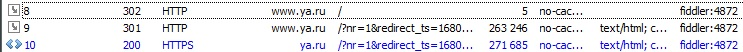

# Перенаправления

Перенаправление - это такая процедура, при которой клиент обращается на сервер
за каким- то ресурсом, а на сервере этого ресурса как бы и нет. В такой ситуации
сервер имеет полное право просто отказать в запросе клиенту, но вместо этого он
возвращает ему код 301 и пояснение Moved permanently или 302 и Moved temporarly.

Такую ситуацию можно увидеть, если обратиться к какому- нибудь сайту по http.
Правда, такой сайт еще надо найти...

```
user@coding:~$ telnet ya.ru 80
Trying 5.255.255.242...
Connected to ya.ru.
Escape character is '^]'.
GET / HTTP/1.1
user-agent: fiddler
host: www.ya.ru

HTTP/1.1 302 Moved temporarily
Accept-CH: Sec-CH-UA-Platform-Version, Sec-CH-UA-Mobile, Sec-CH-UA-Model, Sec-CH-UA, Sec-CH-UA-Full-Version-List,
...
Location: http://www.ya.ru/?nr=1&redirect_ts=1680637798.00000
...
```

Такой код возвращает, к примеру ya.ru
Через заголовок Location яндекс возвращает url, на который он перенаправляет.
В телнете эту процедуру провернуть тяжеловато, но зато в Fiddler все хорошо
видно.



## Коды перенаправлений

- 300 - Multiple choice
- 301 - Moved permanently
- 302 - Found // временное перенаправление
