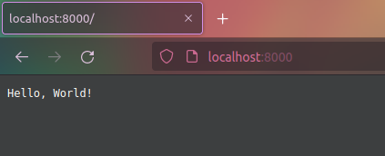

# CGI

CGI (Common Gateway Interface) - интерфейс, способ взаимодействия веб- сервера и
программы. Интерфейс был разработан таким образом, чтобы с ним была возможность
использовать любой язык программирования.

Принцип работы CGI следующий: поступающий HTTP запрос парсится веб-сервером, тем
самым преобразуясь в CGI форму (вид упаковки значений из запроса), после чего
вызывается зоготовленнный скрипт (программа), а ей в параметры передаются
значения из CGI формы. Ответ этой программы запаковывается в HTTP и возвращается
клиенту.

# WSGI

WSGI - питоновская фишка, предложенная в какие- то годы сообществом. В
оригинальном CGI была проблемка: на каждый http запрос приходилось испольнять
программу, то есть каждый раз запускать интерпретатор, в следствие чего росла
инфраструктурная нагрузка.

Решением этого стал WSGI, по которому вместо отдельных приложений запускались
функции, обрабатывающие WSGI форму. Получается, можно было держать всегда
запущенный интерпретатор в памяти, готовый к обработке запроса.

WSGI предстает интерфейсом между "солидными" веб- серверами, такими как Apache
или Nginx и кодом на python. Причем nginx не поддерживает WSGI, для работы с
nginx потребуется дополнительная сущность- питоновское приложение gunicorn.

Согласно стандарту, веб- приложение - это функция, принимающая два аргумента:
словарь переменных окружения и функцию, устанавливающую параметры ответа и
возвращающую итератор. Вот пример подобной WSGI- функции:

```
def app(environ, start_response):
    data = b"Hello, World!\n"
    start_response("200 OK", [
        ("Content-Type", "text/plain"),
        ("Content-Length", str(len(data)))
    ])
    return iter([data])

```

В приведенной выше функции словарь переменных- окружения никак не используется.
Функиця start_response по заданынм параметрам выставляет строку статуса, а также
два заголовка. WSGI функция app возвращает итератор по data.

После написания функции в модуле, остается лишь запустить приложение
**gunicorn**, устанавливаемое через pip:


В аргументы к приложению передается путь до модуля и название функции,
обрабатывающей входящие запросы. -w задает число обрабочиков для очереди входных
запросов.

После того, как приложение запущено- можно обратиться к нему через HTTP:

Через Telnet:

```
user@coding:~$ telnet localhost 8000
Trying 127.0.0.1...
Connected to localhost.
Escape character is '^]'.
GET / HTTP/1.1

HTTP/1.1 200 OK
Server: gunicorn
Date: Fri, 07 Apr 2023 19:07:46 GMT
Connection: close
Content-Type: text/plain
Content-Length: 14

Hello, World!
Connection closed by foreign host.
```

Или даже через браузер:

